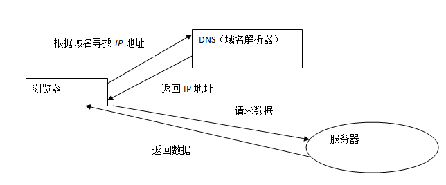
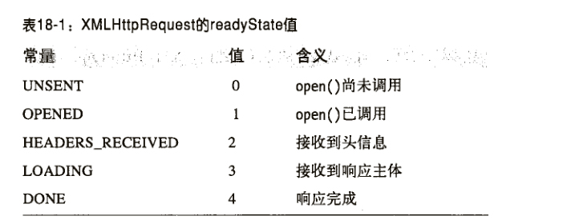
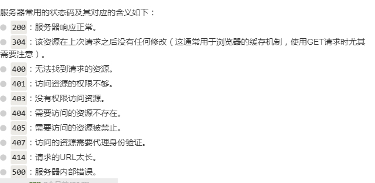

---

title:  ajax详解  #文章标题
date:  #时间，一般不用改
categories:  前端笔记-JS篇
tags:  [JS，ajax,跨域,请求] #标签，格式可以是[Hexo,总结]，中间用英文逗号分开
keywords:  [agax,跨域,请求] #文章关键词，多个关键词用英文逗号隔开

---
## 定义介绍
	1. ajax：ajax通过在后台与服务器进行少量数据交换，可以使网页实现异步更新。这意味着可以在不重新加载整个网页的情况下，
	对网页的某部分进行更新。
	2. 同源策略：一个域内的脚本仅仅具有本域内的权限，可以理解为本域脚本只能读写本域内的资源，而无法
	访问其它域的资源。这种安全限制称为同源策略。
	3. http：超文本传输协议
	4. 跨域：指的是浏览器不能执行不同网站的脚本。它是由浏览器的同源策略造成的，是浏览器施加的安全限制。
	5. XMLHttpRequest：所有浏览器XMLHttpRequest，他定义了用脚本操纵HTTP的API。
* * * *
## 浏览器请求数据原理
   
* * * *
## 请求过程详解
	1. 实例化XMLHttpRequest对象
	2. 一个HTTP请求有4个部分组成
		1.请求的方式
		2.请求的url
		3.一个可选的请求主体
		4.可选的请求头 
	3. 一个服务器响应包括三部分
		1.标识成功失败的状态码
		2.一个响应头集合
		3.一个响应主体
* * * *
## 代码对应的请求过程
```
	var request = new XMLHttpRequest() //实例化XMLHttpRequest对象
	// HTTP请求
	requesrt.open("请求方式"，"请求的URL","是否异步执行")。
	request.setRequestHeader("Content-Type","text/plain") //设置请求头 说明发送的数据类型  
	当请求方式是POST时需要设置当是get时不用设置
	request.send() //向服务器发送请求 get没有请求主体 但是POST 有  而且要和请求头匹配
	// 事件的响应
	getRequestHeader()和getAllRequestHeaders()能查询响应头
	响应主体可以从responseText属性中得到文本形式的，从reponseXML属性中得到document形式的。
	readyState指定了HTTP请求的状态，每当 readyState 改变时，就会触发 onreadystatechange 事件
	注意：最好不要使用同步请求，因为JS是单线程的。
```
   
   
* * * *
## get 请求实例
```
	function get(url,callback){
		var request = new XMLHttpRequest(); 
		request.open('get',url);  
		request.send(null);
		request.onreadystatechange = function(){
			// 判断是否成功
			if(request.readyState === 4 && requeat.status === 200){
				callback(request.responseText);
			}
		}
	}
```
* * * *
## post 请求实例
```
	function post(url,callback){
		var request = new XMLHttpRequest();
		request.open('post',url);
		request.setRequestHeader("Content-type","application/x-www-form-urlencoded");
		request.send("发送数据");
		function.onreadystatechange = function(){
			if(request.readyState == 4 && request.status == 200){
				callback(request.responseText);
			}
		}
	}
```	
* * * *
## 跨域请求
	1. 现在的浏览器都支持CORS，如果服务器支持跨域请求，那就可以实现跨域请求。
	2. JSONP：用<script>发送HTTP请求，将script插入到document中，然后浏览器会去请求下载src指向的URL。并且包含JSON编码的数据会自动执行。
	JSONP请求的不足：JSONP请求可能会带来安全隐患，而且不容易判断请求是否成功
* * * *	
