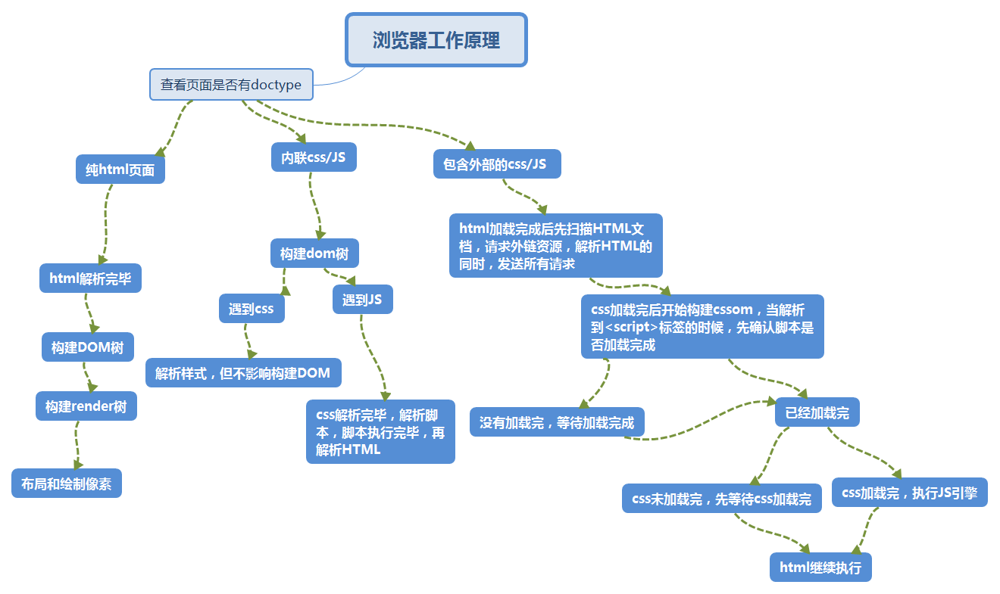

---

title:  浏览器工作原理
date:  #时间，一般不用改

tags:  [浏览器工作原理,浏览器,工作原理] #标签，格式可以是[Hexo,总结]，中间用英文逗号分开
keywords:  [浏览器工作原理,浏览器,工作原理] #文章关键词，多个关键词用英文逗号隔开

---
1.     了解浏览器的工作原理对于前端代码的优化有很大的帮助，下面是浏览器工作原理的草图，我会根据图进行讲解。
2.     
3.     划重点
	+ 浏览器在解析HTML之前，会先检查页面是否有doctype,doctype规定浏览器按哪种模式渲染。
	+ dom树构建完毕时就会执行DOMContnetLoaded()函数，即执行$(document).ready()。
	+ JS引擎的工作原理是：扫描全局变量，确定已经声明的变量/函数名，然后再顺序执行所有语句
	+ 如果设置了async属性，则JS加载完成后会立即执行，前提是CSS加载完成，而html也会继续解析，两者互不影响，一起执行
	+ 为什么会有这些顺序呢？因为脚本有可能改变 DOM 内容，所以 HTML 的解析必须等到脚本执行完毕后再继续。
	脚本又有可能操作 CSSOM ，所以脚本必须等到 CSS 解析完毕后才能执行。
	+ html在解析编译的时候不仅有DOM树，还有render树，render树的构建是在DOM树构建完成之后。render树的主要作用是用来渲染的

