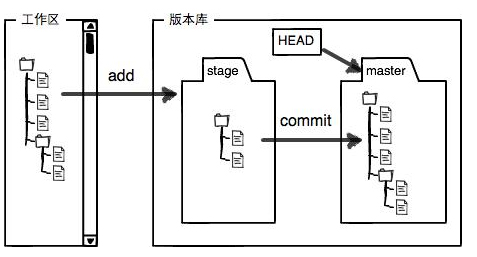

---

title:  git入门小结  #文章标题
date:  #时间，一般不用改
categories:  前端笔记-git篇
tags:  [前端,git] #标签，格式可以是[Hexo,总结]，中间用英文逗号分开
keywords:  [git入门,git指令] #文章关键词，多个关键词用英文逗号隔开

---
# git入门小结
1.	git是分布式版本控制系统。
2.	git与svnde 比较
	+	集中式版本控制系统指的是版本库是集中存放在中央服务器的，而干活的时候，用的都是自己的电脑，所以要先从中央服务器取得最新的版本，然后开始干活，干完活了，再把自己的活推送给中央服务器.
	+	分布式版本控制系统根本没有“中央服务器”，每个人的电脑上都是一个完整的版本库，这样，你工作的时候，就不需要联网了，因为版本库就在你自己的电脑上。
	+	与集中式版本控制系统（例如：SVN）相比集中式版本控制
	系统最大的毛病就是必须联网才能工作。
* * * *
3.	git的版本库
	+	工作区有一个隐藏目录.git，这个不算工作区，而是Git的版本库。
	+	版本库可以简单理解成一个目录，这个目录被git 管理起来，每个文件的修改、删除、git都能跟踪
	+	Git的版本库里存了很多东西，其中最重要的就是称为stage（或者叫index）的暂存区，还有Git为我们自动创建的第一个分支master，以及指向master的一个指针叫HEAD。
	+	特别注意得是：git只提交stage里的东西，所以提交之前一定要add再commit，不能直接commit
* * * *
4.   
* * * *
5.	git部分命令
	+	git init (将一个目录变成git管理仓库)
	+	git add "文件名"（将文件添加到仓库）
	+	git commit -m ""(把文件提交到仓库)
	+	git status （掌握当前仓库的状态）
	+   git diff (查看不同)
	+   git log (显示从近到远的提交日志)
	+	git	reflog (记录每次命令，以便找到 commit id)	
* * * *
6.  参考：https://www.liaoxuefeng.com/